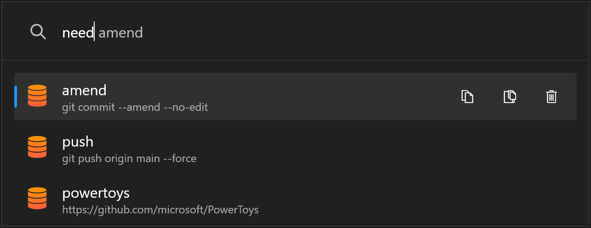
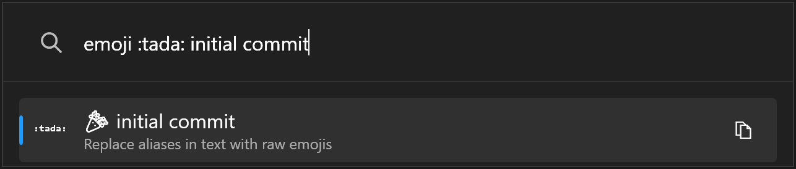

### Hej! 👋

> Freelance software developer crafting software FTW 👨‍💻

My name is **Henrik Lau Eriksson** 👨‍🦰 and I live in [_Stockholm_](https://www.visitstockholm.com), [_Sweden_](https://sweden.se) [📌](https://goo.gl/maps/covF4kkUiPC2)

I work with:

><code></code>
><code></code>
><code></code>
><code></code>

I write code for the Web 🌐

```
- Usually backend 🐴
- Sometimes frontend 🦄
```

I like to work in a DevOps context ♾️

```
- In the "union of people, process and products" 💬
```

I prefer Continuous Deployment ♻️

```
- Release early and often ⏩
- Fail fast 💥
```

Things I find interesting:

```
- Cloud ☁
- Serverless ⚡
- JAMstack 📚
```

Things I have experience with:

```
- Agile 🐒
- Architecture 📐
- TDD / BDD / Specification by Example ✔️
```

#### Projects

---

I'm a daily PowerToys Run user 🗂️🔎

Here are some plugins that tickle my fancy:

- [awesome-powertoys-run-plugins](https://github.com/hlaueriksson/awesome-powertoys-run-plugins)

And for a sprinkle of my own magic:

- [Community.PowerToys.Run.Plugins](https://github.com/hlaueriksson/Community.PowerToys.Run.Plugins)

<details>

<summary>View example:</summary>



- Store things you need, but can't remember

</details>

---

I love emoji ❤️

Check out the full list of what’s supported on GitHub:

- [github-emoji](https://github.com/hlaueriksson/github-emoji) :octocat:

Are you a dotnet fan? Give my library a spin:

- [GEmojiSharp](https://github.com/hlaueriksson/GEmojiSharp)

<details>

<summary>View example:</summary>

```csharp
":tada: initial commit".Emojify(); // 🎉 initial commit
```

- C#

```html
<emoji>:tada: initial commit</emoji>
```

- ASP.NET Core

```html
<Emoji>:tada: initial commit</Emoji>
```

- Blazor

```cmd
emoji emojify :tada: initial commit
```

- CLI



- PowerToys Run

</details>

---

Do you keep your commands and queries separated?

Get started with this RPC library of mine:

- [CommandQuery](https://github.com/hlaueriksson/CommandQuery)

<details>

<summary>Support for:</summary>

- AspNetCore 🌐
- AWSLambda ⚡
- AzureFunctions ⚡
- GoogleCloudFunctions ⚡

</details>

---

Do you enjoy writing unit tests and are on the lookout for something new?

Check out this quirky little framework:

- [LoFuUnit](https://github.com/hlaueriksson/LoFuUnit)

<details>

<summary>View example:</summary>

```csharp
public class MoodTests : LoFuTest<MoodIdentifier>
{
    string _mood;

    [LoFu, Test]
    public void Identify_mood_on_mondays()
    {
        void given_the_current_day_is_monday()
        {
            var monday = new DateTime(2011, 2, 14);

            Use<ISystemClock>()
                .CurrentTime
                .Returns(monday);
        }

        void when_identifying_my_mood() =>
            _mood = Subject.IdentifyMood();

        void should_be_pretty_bad() =>
            _mood.Should().Be("Pretty bad");
    }
}
```

</details>

---

Do you need markup in the frontend?

Generate some HTML in the backend:

- [Markupolation](https://github.com/hlaueriksson/Markupolation)

<details>

<summary>View example:</summary>

```csharp
DOCTYPE() +
html(lang("en"),
    head(
        meta(charset("utf-8")),
        e.title("Markupolation"),
        meta(name("description"), content("Sample of how to use Markupolation")),
        meta(name("viewport"), content("width=device-width, initial-scale=1"))
    ),
    body(
        h1("Hello, World!"),
        p("This is ", mark(a.title("Markup with string interpolation"), "Markupolation"), " in action.")
    )
);
```

</details>

---

I have built my own URL shortener, and you can do it too ✂️🔗

Get started with this template repository:

- [jekyll-url-shortener](https://github.com/hlaueriksson/jekyll-url-shortener)

---

#### Contact

Find out more about me:

- [henrik.laueriksson.com](https://henrik.laueriksson.com)
- [conductofcode.io](https://conductofcode.io)
- [linkedin.com/in/henriklaueriksson](https://www.linkedin.com/in/henriklaueriksson)

Let's get in touch:

- [@hlaueriksson](https://twitter.com/hlaueriksson)
- [henrik@laueriksson.com](mailto:henrik@laueriksson.com)
